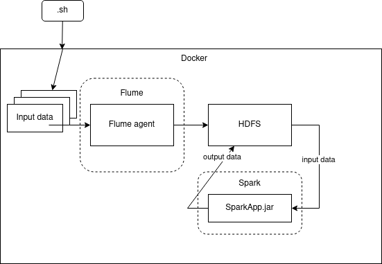

# lab 2

(a). Программа должна подсчитывать статистику взаимодействия пользователей с новостной лентой для каждой новости за все время. Входные данные: справочник типов взаимодействия (1 - открыл и прочитал, 2 - открыл на предпросмотр, 3 - не взаимодействовал), идентификатор новости, идентификатор пользователя, время взаимодействия, идентификатор типа взаимодействия. Выходные данные: идентификатор новости, тип взаимодействия, количество типов взаимодействия с новостью.

(b). Технология подачи новых данных в систему: Flume agent

(c). Технология хранения: HDFS

(d). Технология обработки данных: Spark RDD

## Подготовка

1. Выполнить все пункты подготовки из первой лабораторной работы.
2. Запустить команду: `cd /opt && wget https://www-eu.apache.org/dist/maven/maven-3/3.6.3/binaries/apache-maven-3.6.3-bin.tar.gz && tar xzf apache-maven-3.6.3-bin.tar.gz && ln -s apache-maven-3.6.3 maven vi /etc/profile.d/maven.sh`.
3. В открывшемся файле на редактирование из под `vim` вставить следующие строки:
```comandline
export M2_HOME=/opt/maven
export PATH=${M2_HOME}/bin:${PATH}
```
4. Запустить команду: `docker pull zoltannz/hadoop-ubuntu:2.8.1`.

## Запуск вычислений

1. Запустить команду: `systemctl start docker && systemctl enable docker && docker container prune && docker run --name spark_hdfs_flume_container -p 2122:2122 -p 8020:8020 -p 8030:8030 -p 8040:8040 -p 8042:8042 -p 8088:8088 -p 9000:9000 -p 10020:10020 -p 19888:19888 -p 49707:49707 -p 50010:50010 -p 50020:50020 -p 50070:50070 -p 50075:50075 -p 50090:50090 -t zoltannz/hadoop-ubuntu:2.8.1`, где вместо слова `spark_hdfs_flume_container` указать имя запускаемого докер-контейнера. Не закрывать этот терминал вплоть до завершения работы.
1. Открыть новый терминал, перейти в директорию этой лабораторной работы, выполнить скрипт: `./startHadoopContainer.sh spark_hdfs_flume_container && docker exec -it spark_hdfs_flume_container bash`, после того как скрипт выполниться в этом же окне выплнить последовательно:
   1. `./flume.sh`,
   2. `./calculate.sh`.

### Cхема взаимодействия компонентов


Как видно из рисунка, через ряд шелл скриптов запускается докер контейнер с `.jar` файлом со всему зависимостями и запускается `HDFS`. Внутри докер контейнера запускает шелл скрипт, который создаёт текстовые входные данные в образе докера, через шелл скрипт затем устанавливается `Flume`, который после установки в качестве демона начнёт загружать файлы в `HDFS`. Затем здесь же запускается скрипт, который устанавливает `Spark`, который после установки подсчитает число страниц и иденификаторов взаимодействия и положит эти данные обратно в `HDFS`.
