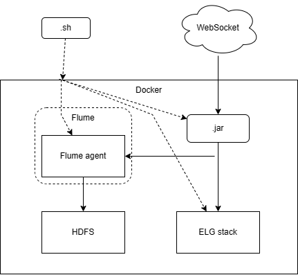

# lab 3

(a). Бизнес логика: Для любого доступного публичного stream API (например, https://www.quora.com/Where-can-I-find-public-or-free-real-time-or-streaming-data-sources ) написать программу, которая вычисляет количество некоторых событий (метрик, сообщений и т.д) поминутно и отправляет агрегированные данные в Elasticsearch (count/timeline graph). 

(b). Формат поставки: Ubuntu Dockerfile с bash-скриптами настройки окружения

(c). Способ передачи данных в Elasticsearch: logstash

(d). Технология визуализации: Grafana

## Подготовка

1. Выполнить все пункты подготовки из первой лабораторной работы.
2. Запустить команду: `cd /opt && wget https://www-eu.apache.org/dist/maven/maven-3/3.6.3/binaries/apache-maven-3.6.3-bin.tar.gz && tar xzf apache-maven-3.6.3-bin.tar.gz && ln -s apache-maven-3.6.3 maven vi /etc/profile.d/maven.sh`.
3. В открывшемся файле на редактирование из под `vim` вставить следующие строки:
```comandline
export M2_HOME=/opt/maven
export PATH=${M2_HOME}/bin:${PATH}
```
4. Запустить команду: `docker pull zoltannz/hadoop-ubuntu:2.8.1`.

## Запуск всей цепочки программ

1. Включить VPN.
1. Запустить HDFS: `/opt/hadoop-2.10.2/sbin/start-dfs.sh`
1. Запустить команду: `systemctl start docker && systemctl enable docker && docker container prune && docker run --name ELG_stack -p 2122:2122 -p 8020:8020 -p 8030:8030 -p 8040:8040 -p 8042:8042 -p 8088:8088 -p 9000:9000 -p 10020:10020 -p 19888:19888 -p 49707:49707 -p 50010:50010 -p 50020:50020 -p 50070:50070 -p 50075:50075 -p 50090:50090 -d -p 3000:3000 -p 9200:9200 -p 5601:5601 -p 5400:5400 -t zoltannz/hadoop-ubuntu:2.8.1`. Не закрывать этот терминал вплоть до завершения работы.
1. Открыть новый терминал, перейти в директорию этой лабораторной работы, выполнить скрипт: `~/DS/ds_labs/lab3/scripts/moveToContainer.sh ELG_stack && docker exec -it ELG_stack bash`, после того как скрипт выполниться в этом же окне выплнить `./install.sh`.
1. Открыть новый терминал, выполнить последовательно в одном и том же окне:
   1. `docker exec -it ELG_stack bash`,`./install.sh`,
   2. `./run.sh`
1. Открыть новый терминал, выполнить последовательно в одном и том же окне:
   1. `docker exec -it ELG_stack bash`,`./install.sh`,
   2. `java -jar lab3-1.0-SNAPSHOT-jar-with-dependencies.jar`

### Cхема взаимодействия компонентов


Как видно из схемы, сначала shell скрипты инициализируют докер контейнер с установкой программ и конфигураций, после чего другими shell скриптами запускаются: Flume, Java приложение и технологический стек ELG = ElasticSearch Logstash Grafana. Flume и ELG при запуске начинают ждать данных из Java приложения. Java приложение в свою очередь подключается к вебсокету потокового публичного API по ссылке "wss://ws.coincap.io/trades/binance". Flume считывает данные в неизменённом состоянии и помещает их в HDFS. Logstash считывает уже упорядоченные данные и складывает их в ElasticSearch, к которому подключён Grafana, отображающая аналитику на странице "http://localhost:3000".
